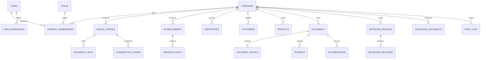

# QUICKFACT — Diseño inicial de datos (Fase 4)

Estado: diseño lógico previo a migraciones.
Alcance: entidades, relaciones, claves y restricciones para orientar la implementación incremental. No se crean tablas en esta fase.

## 1. Reglas generales

- Claves primarias UUID generadas en backend o base de datos.
- Fechas de auditoría en UTC (`created_at`, `updated_at`); fechas de vigencia del período son fechas calendario de Ecuador.
- Importes monetarios en `NUMERIC`, no en coma flotante. Códigos tributarios y números de comprobante se almacenan como texto para preservar ceros iniciales.
- Tablas propiedad de una empresa incluyen `company_id NOT NULL` y lo incluyen en índices y restricciones únicas tenant.
- Las relaciones entre filas tenant usan claves compuestas `(company_id, id)` para impedir referencias cruzadas incluso por error de aplicación.
- El `company_id` efectivo lo establece el backend desde la identidad autenticada, nunca se considera confiable por venir del navegador.
- No se borran períodos, consumos, documentos ni auditoría por cascada. Se desactivan o conservan según reglas del dominio.
- Los estados se representan con catálogo/enum controlado y transiciones en backend. El frontend no puede cambiar un estado enviando un valor arbitrario.

## 2. Núcleo de identidad y tenant

### `companies`

Empresa cliente: RUC, razón social, nombre comercial, dirección matriz, teléfono, correo de contacto, datos tributarios definidos para Ecuador, estado y marcas de tiempo. RUC con índice único global sujeto a validación de formato en backend.

### `users`

Identidad de acceso: username normalizado, hash de contraseña, nombres, apellidos, cédula, RUC opcional, teléfono, estado, último acceso y marcas de tiempo. No guardar contraseña ni confirmación de contraseña. Username normalizado único global evita ambigüedades al iniciar sesión.

El usuario adicional pertenece a una única empresa. El Owner de QUICKFACT puede ser una identidad de plataforma sin empresa cliente. Esta regla se valida en backend y con restricciones según el esquema que se implemente.

### `roles`, `permissions`, `role_permissions`, `user_permissions`

- `roles`: catálogo de roles de plataforma y empresa, con alcance explícito (`PLATFORM` o `COMPANY`).
- `permissions`: catálogo estable de permisos con códigos de aplicación; los códigos cubren únicamente permisos definidos en el documento maestro.
- `role_permissions`: relación entre roles y permisos predeterminados para cada rol.
- `user_permissions`: permisos granulares adicionales o excepciones asignadas a un usuario, asociados a empresa cuando su alcance sea de empresa; actor que los asignó y fecha.

La pertenencia/rol efectivo de cada usuario se conserva con una relación de membresía explícita, propuesta como `company_memberships` (`company_id`, `user_id`, `role_id`, estado, fechas). Restricción única `(company_id, user_id)`. Los roles de plataforma no se mezclan con membresías tenant.

## 3. Períodos, límites y consumo

### `annual_periods`

`company_id`, fecha de inicio, fecha de vencimiento, estado, autor de creación y marcas de tiempo. Se conserva el historial. Se impide solapamiento de períodos activos para una empresa; se valida en transacción. No se asume que el año calendario coincida con el período contratado.

### `document_limits`

Límite configurado por período, separado por tipo o total según la definición comercial aprobada. Referencia `company_id` y `annual_period_id`; cantidad permitida y actor que la modificó. El valor inicial documentado es 15 comprobantes anuales, modificable por Owner.

### `consumption_ledger`

Libro inmutable de débitos/reversiones de consumo: empresa, período, documento relacionado cuando aplique, cantidad con signo o tipo de movimiento, motivo, fecha e idempotency key. Índice único para impedir contabilizar dos veces el mismo documento/movimiento. El total se deriva de movimientos válidos; no depende de un contador enviado por el cliente.

## 4. Configuración de emisión y secretos

### `establishments` y `emission_points`

Ambas pertenecen a `company_id`. El establecimiento conserva código, dirección y estado; el punto de emisión conserva su código, establecimiento padre y estado. Restricciones únicas por empresa para los códigos correspondientes. Los consecutivos se definirán y reservarán en backend dentro de transacción cuando se estudie la regla oficial; no se asignan en frontend.

### `certificates`

Metadatos tenant del certificado: empresa, almacenamiento cifrado o referencia a secreto, huella/hash de identificación, fechas de vigencia, estado y autor/fecha de carga. No almacenar material privado o contraseña en texto plano. Accesos y cambios deben quedar auditados. La integración de firma queda fuera de alcance hasta verificar los requisitos oficiales.

## 5. Entidades de módulos posteriores

Estas entidades están previstas porque aparecen en el alcance, pero se crean junto con sus fases; no se implementan todas en el arranque.

### Catálogos y stock

- `products`: empresa, tipo producto/servicio, código, descripción, precio, impuestos definidos para la fase tributaria, estado.
- `stock`: saldo por empresa y producto únicamente cuando aplique control de inventario; no se usa para servicios.
- `stock_movements`: entradas/salidas relacionadas con operaciones identificables; historial inmutable. El ajuste manual de stock no se habilita a usuarios adicionales.

### Clientes y comprobantes

- `customers`: empresa, identificación, tipo de identificación, razón/nombre, contactos, dirección y estado.
- `documents`: empresa, tipo permitido en V1 (factura, nota de crédito, nota de débito o guía), establecimiento, punto de emisión, secuencial asignado por backend, cliente cuando corresponda, período, estado controlado, totales y referencias al documento relacionado cuando aplique.
- `document_details`: empresa, documento, producto/servicio o descripción, cantidades, precios, descuentos e impuestos conforme al esquema tributario que se verifique antes de implementar.
- `payments`: formas y valores de pago del comprobante conforme a requisitos oficiales verificados.
- `additional_information`: pares de información adicional vinculados al documento, con límites y validación definidos en la fase de comprobantes.
- `document_supports`: metadatos/referencias privadas a archivos asociados; el binario no va en PostgreSQL.
- `authorizations`: respuestas y referencias de autorización vinculadas al documento, con ambiente, estado, fechas y correlación de proceso.

Retenciones emitidas y liquidaciones de compra quedan excluidas de V1. No se agregan tipos de documento fuera de los cuatro autorizados.

### Retenciones recibidas y programación

- `retention_received`: empresa, emisor, clave/identificador tributario, fecha, estado de procesamiento y referencias privadas de XML; restricción de duplicados por empresa y clave/identificador.
- `retention_relations`: empresa, retención, documento relacionado, método y usuario/fecha de vinculación; evita relación entre empresas.
- `scheduled_documents`: empresa, tipo de documento autorizado, configuración de programación definida en su fase, estado de programación, próxima ejecución, actor y fechas. Los estados y transiciones se controlan en backend.

### Auditoría y correo

- `audit_logs`: empresa nullable para acciones de plataforma, actor, acción, entidad/ID, resultado, fecha, request ID y metadatos permitidos. No guardar secretos ni payload tributario completo.
- `email_logs`: empresa, documento/evento asociado, destinatario, estado, proveedor/referencia, intentos y fechas. Evitar contenido completo sensible.

## 6. Relaciones de referencia

El diagrama resume vínculos; las tablas se incorporarán por fase, con restricciones tenant compuestas aunque no se dibujen en Mermaid.

## 7. Índices y restricciones mínimas

- Índices en todas las FK y en `company_id`.
- Unicidad de username normalizado y RUC empresarial.
- Unicidad de códigos de establecimiento/punto dentro de empresa.
- Unicidad tenant del identificador de documento/secuencial una vez definidos los formatos oficiales.
- Unicidad de clave/identificador de retención recibida dentro de empresa.
- Comprobación de importes no negativos donde corresponda, y cantidades/estados válidos.
- FKs compuestas con `company_id` para relaciones entre datos tenant.
- RLS `ENABLE` y `FORCE` en tablas tenant sensibles, con políticas de lectura/escritura por ámbito; el rol propietario de migraciones será distinto al rol runtime.

## 8. Orden sugerido de migraciones

1. Núcleo: empresas, usuarios, roles, permisos y membresías.
2. Períodos, límites y libro de consumo.
3. Configuración: establecimientos, puntos y metadatos de certificados.
4. Productos, stock y clientes.
5. Facturas y entidades asociadas.
6. Notas de crédito, notas de débito y guías.
7. Retenciones recibidas y relaciones.
8. Programación, auditoría complementaria y correo.

Cada migración tendrá revisión, se aplicará en un entorno no productivo primero y evitará cambios destructivos sin una estrategia de transición.

## 9. Antes de generar el esquema físico

Durante la fase de implementación del esquema se concretarán tipos, nombres SQL, enums, índices exactos, políticas RLS, reglas de retención de datos y campos tributarios. Cualquier campo que dependa de estructuras del SRI se verificará con documentación oficial vigente. Esta fase no crea columnas tributarias especulativas ni tablas de funciones no definidas.
